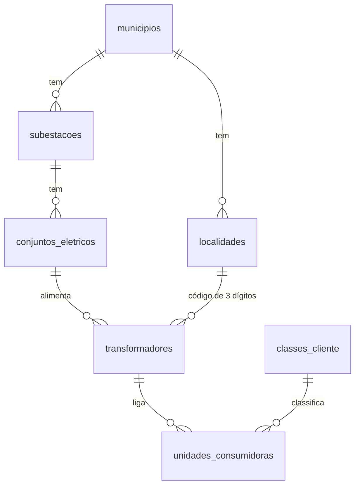
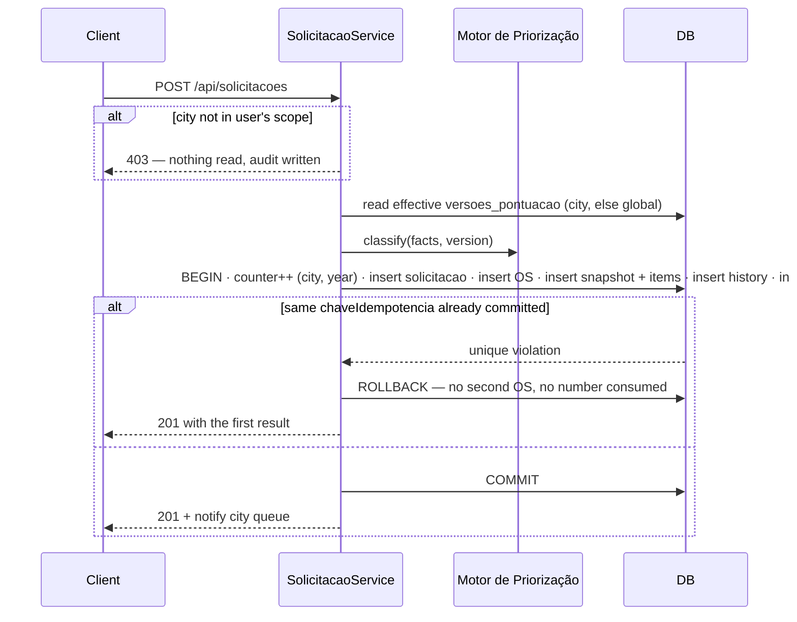
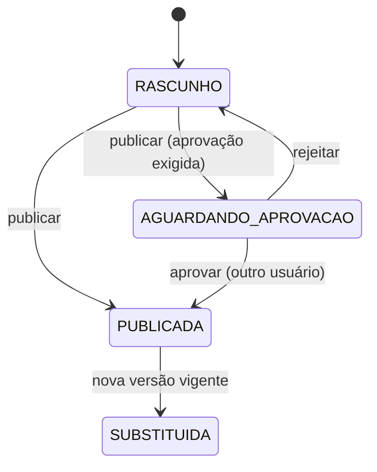
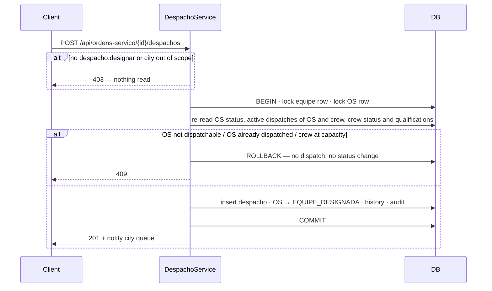
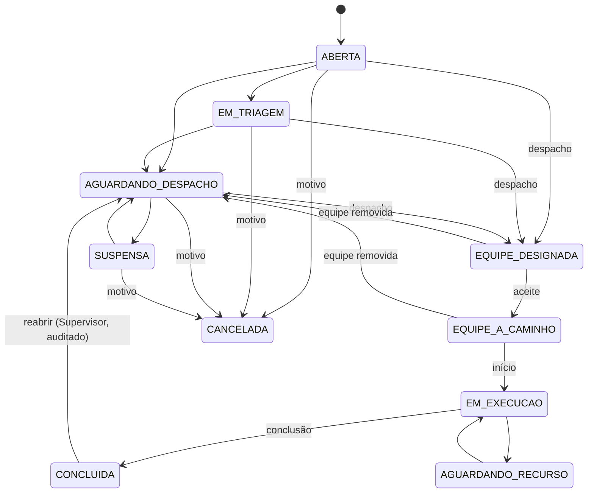

# Farol — Gestão, Priorização e Despacho de Ordens de Serviço Elétricas

> Plan from this document. Each slice below carries its own shape - copy it, do not re-derive it.
> Status: committed by the project owner, 2026-10-10, in `prompt_projeto_v1_corrigido.md` (Versão 1: critérios fixos, pontuação definida pelo Usuário Chave). Design draft by Claude, 2026-10-10.

## Situation

- Project: not shipped yet — greenfield; no code, no users, no production data.
- Decision: committed by the project owner, 2026-10-10, in `prompt_projeto_v1_corrigido.md` (seções 0–25). The verdict is a record, not a gate.
- In flight: the only precedent is the fictitious customer base `Experimento_Dados_Ficticios - BASE CLIENTES 1.xlsx` (200 UCs, empresa `EMP_TESTE`), which seeds every demonstrative record; `prompt_projeto_v2_casos_configuraveis.md` (critérios configuráveis) stays out.
- At stake: expensive to be wrong — the priority policy decides which risk a crew reaches first; the schema of classification snapshots and the city partition are one-way once OS accumulate.

## Problem

Construction. This piece was promised to answer four questions for a dispatch center that today has no system at all: which OS goes first, why it has that priority, which crew is able and free, and which crew is the best option by place, travel, capacity and priority. Without it nothing downstream can start — official SGM codes, deadlines and points cannot be loaded anywhere, and the Usuário Chave has no place to publish them. There is no measured cost: the operation has not met the product, so every number in this document is a demonstrative default marked non-official, never a finding.

## Success

- Worked if: a request typed in the first screen appears, classified and explained, in the city queue of the second screen without any further entry, and a crew can be dispatched to it with the coordinates delivered — exercised end to end by the automated tests against PostgreSQL.
- Going wrong: an OS whose position no user can explain from its detail modal; a "Desconhecida" answer scoring as zero; a dispatch accepted for a crew already at capacity.
- Review: when the Usuário Chave publishes the first non-demonstrative version — Usuário Chave and Supervisor compare ten real OS against their expectation.

## Boundary

In: the 14 pages of seção 20, the two-layer priority engine, the Usuário Chave screen, city partition, dispatch with recommendation, map, audit, tests, Docker Compose and README.

Out: integration with the official SGM, commercial UC registry, network GIS and crew GPS — no credentials exist; each has an interface and a demonstrative provider. Mobile app for field crews — crews act through the same web screens. PostGIS — distances are computed from latitude/longitude; PostGIS becomes worth it only when segment geometries arrive. Free-text analysis — the description never changes points (seção 4.6).

Unchanged: the 39 columns of the fictitious base keep their meaning; NUMCDC is the UC number, CIRCUITO the substation code, CONJUNTO the electrical set, TRANSFORMADOR the transformer suffix.

## Shape

The record is the `ordens_servico` row, born in one transaction with its `solicitacoes` row and its first `resultados_prioridade` snapshot, partitioned by `municipio_id`. Classification is a pure function of the OS facts and one published `versoes_pontuacao` (points per option + score bands), run first through the Layer A precedence rules; every run writes an immutable snapshot and the OS points to the current one. The door is the snapshot: once OS hold results computed under a version, that version can never be edited, only superseded — changing that later means rewriting audit history. The heavier alternative, an expression-based rules engine where admins author criteria as formulas, wins only if the operation must add criteria weekly without a release, and version 1 fixes the criteria list by design.

## Key decisions

1. **Every `solicitacoes` and `ordens_servico` row has a mandatory `municipio_id`, and every query is scoped server-side to the caller's cities.** The scope is applied in the data layer from the authenticated user's links, never from a frontend parameter alone; an out-of-scope id answers 403 and writes an `auditoria` row. "Todas as cidades" is a permission (`cidades.todas`), and queue position is always computed inside the OS's own city.
2. **A classification result is an immutable snapshot tied to the `versoes_pontuacao` that produced it.** Reclassification (new data, linked request, elapsed time, new version, manual review) inserts a new `resultados_prioridade` with its items; nothing updates an old one. A published version is never edited — restoring an old one copies it into a new version.
3. **Precedence is a separate layer, not points.** Layer A rules (`regras_precedencia`, admin-approved) yield a precedence level and a minimum priority code; Layer B points pick the code by band. Final code = the more urgent of the two. Queue order inside a city: precedence level desc → priority rank asc → corretiva before preventiva → points desc → next deadline asc → opened at asc → OS number asc. This is the only place corretiva/preventiva precedence lives, so a preventive OS with critical risk rises through Layer A, never through a hidden number.
4. **"Unknown" is an answer with explicit points.** Every option of an enabled criterion, including "Desconhecida", "Não identificado" and "Não informada", must have a non-null integer in the version; `null` means "sem pontos definidos" and blocks publication. Absent facts map to the unknown option, never to "no points".
5. **OS and request numbers are generated in the database transaction from a per-city, per-year counter**, format `{PREFIXO}-{ANO}-{SEQ:000000}` (configurable), with a unique index as the final guard; two concurrent requests in the same city never share a number and a failed transaction leaves no gap-filling orphan.
6. **One active dispatch per OS, and a crew never holds more active dispatches than its `capacidade`.** Assigning locks the crew and re-checks status, compatibility and capacity inside the transaction; the loser of a race gets 409 and nothing is written. Incompatible or unavailable crews are assignable only as a formal exception (`despacho.excecao` + justification), and other-city crews only as "apoio intermunicipal" with justification.
7. **The transformer number is text.** The first 3 digits are the locality code, the rest the local equipment number, both stored in their own columns; uniqueness is (`codigo_localidade`, `numero_local`). Leading zeros survive every layer.
8. **The simulator, the impact tab and production share one engine** — the backend classification service; the frontend never re-implements a rule.

## Work

| Slice | Delivers | Status |
|---|---|---|
| [Fundação](#fundação) | solution, PostgreSQL schema via migrations, Identity + JWT, profiles, city links, audit | clear |
| [Cadastros da Rede](#cadastros-da-rede) | municípios, localidades, subestações, conjuntos, transformadores, classes, UC, CEP, coordinates | open — 3 defaults taken |
| [Solicitacao](#solicitacao) | Nova Solicitação form → request + OS + first classification in one transaction | clear |
| [Priorizacao](#priorizacao) | criteria, options, Layer A rules, engine, deadlines, reclassification | open — 2 defaults taken |
| [VersaoPontuacao](#versaopontuacao) | Usuário Chave screen: points, bands, simulator, impact, versions, publication | clear |
| [Painel Operacional](#painel-operacional) | indicators, queue table, filters, detail modal, 60 s refresh, city selector | clear |
| [Despacho](#despacho) | crews, recommendation, assignment, acceptance, execution, conclusion | clear |
| [Mapa](#mapa) | Leaflet map of OS, crews and substations, comparison and route when available | open — 1 default taken |
| [Unificacao](#unificacao) | duplicate suggestions and authorised merge | clear |

Order: Fundação → Cadastros da Rede → Priorizacao → Solicitacao → VersaoPontuacao → Painel Operacional → Despacho → Mapa → Unificacao.

Already handled by the platform: session expiry → 401 and redirect to Login; backend unreachable → queue keeps its data with a "dados podem estar desatualizados" notice and a retry.

Derivable from the repository, left to the plan: error body (RFC 7807 ProblemDetails with field errors), pagination (`pagina`, `tamanhoPagina`, `total`), UTC storage with `America/Sao_Paulo` display, snake_case table names, audit of every write — all as the Fundação slice establishes them.

### Fundação

**Delivers** the runnable skeleton: .NET 10 Web API in four projects (Domain, Application, Infrastructure, API), React + Vite + TypeScript strict frontend, PostgreSQL with EF Core migrations, Identity + JWT, six profiles and the audit log. **Status: clear.**

| State | What should happen | Caller sees |
|---|---|---|
| First start, empty database | migrations run; reference data and the demonstrative set load only when `Farol__Demo__Habilitado=true`; the admin is created only from `FAROL_ADMIN_EMAIL` / `FAROL_ADMIN_SENHA` | — |
| Wrong credentials | refused, attempt audited, no hint which field failed | 401 "Credenciais inválidas" |
| Token without permission | refused before any read | 403 |
| Access to an OS of a city not linked | refused, attempt audited (Key decision 1) | 403 |

`POST /api/auth/login` `{email, senha}` → `200` `{token, expiraEm, usuario:{id, nome, perfis[], permissoes[], municipios[], municipioPreferidoId}}`
`GET /api/me` → `200` same `usuario`
`PUT /api/me/preferencias` `{municipioPreferidoId|null}` → `204`

Table `auditoria`.

| Column | Type | Null | References | Note |
|---|---|---|---|---|
| `id` | bigint | no | | identity |
| `ocorrido_em` | timestamptz | no | | UTC, index |
| `usuario_id` | uuid | yes | `usuarios.id` | null for anonymous attempts |
| `acao` | text | no | | `CRIAR`, `ALTERAR`, `RECLASSIFICAR`, `DESPACHAR`, `PUBLICAR`, `ACESSO_NEGADO`, `CONSULTA_UC`, … |
| `entidade`, `entidade_id` | text | no | | index (`entidade`, `entidade_id`) |
| `municipio_id` | int | yes | `municipios.id` | |
| `valores_anteriores`, `valores_novos` | jsonb | yes | | never tokens or passwords |
| `justificativa` | text | yes | | |

Profiles and permissions: Administrador (all), Atendente (`solicitacao.registrar`, `os.consultar`), Despachante (`os.consultar`, `os.status`, `despacho.designar`), Supervisor (Despachante + `os.reclassificar`, `os.trocar-municipio`, `os.unificar`, `despacho.excecao`, `cidades.todas`), Equipe de campo (`os.consultar`, `os.status` on its own dispatches), Usuário Chave (`pontuacao.editar`, `pontuacao.publicar`, `os.consultar`). Everyone with `os.consultar` reads the published scoring.

### Cadastros da Rede

**Delivers** the administrable registry and the lookups the request form needs. **Status: open — 3 defaults taken.**

| State | What should happen | Caller sees |
|---|---|---|
| UC found | class, situation, address, transformer, circuit, set shown; personal name masked; the query audited (`CONSULTA_UC`) | 200, `demonstrativa: true` badge |
| UC not in registry | accepted as typed, flagged "não validada no cadastro" | 404 on lookup; form keeps the value |
| UC typed in wrong format | refused at lookup and at submit | 400 "Formato de UC inválido" |
| Transformer `1034897` | locality `103` (name if registered) + local number `4897`; if registered, circuit and set suggested as "identificado pelo cadastro, a confirmar" | 200 interpretation |
| Transformer with unknown locality | accepted, flagged "localidade não cadastrada, confirmar" | 200 with flag |
| Transformer with < 4 digits, non-digits or > max length | refused | 400 |
| CEP of a single-CEP city | city resolved, street left for manual entry | 200 `cepUnico: true` |
| CEP lookup fails or provider disabled | manual entry allowed | 200 `encontrado: false` |
| Coordinates pasted as text, map link or DMS | parsed to WGS84 decimal; out of range refused; outside Brazil or outside the city radius warned, not blocked | 200 `{latitude, longitude, alertas[]}` / 400 |
| City with OS deleted | refused; only deactivation | 409 "Município com OS vinculada não pode ser excluído" |

`GET /api/municipios` → `200` `[{id, nome, uf, codigoIbge, prefixo, latitude, longitude, raioKm, cepUnico, ativo}]`
`GET /api/municipios/{id}/subestacoes` → `200` `[{id, codigo, nome, local, latitude, longitude}]`
`GET /api/subestacoes/{id}/conjuntos` → `200` `[{id, numero}]`
`GET /api/transformadores/interpretar?numero=` → `200` `{numero, codigoLocalidade, numeroLocal, localidade:{codigo,nome}|null, localidadeCadastrada, transformador:{id, subestacaoId, conjuntoId, ucsLigadas}|null}`
`GET /api/unidades-consumidoras?uc=` → `200` `{numero, clienteMascarado, classe, situacao, endereco, bairro, municipioId, transformador, subestacao, conjunto, latitude, longitude, demonstrativa}`
`GET /api/geocodificacao/cep/{cep}` → `200` `{encontrado, cep, logradouro, bairro, municipioId, cepUnico}`
`POST /api/geocodificacao/coordenadas/interpretar` `{texto, municipioId}` → `200` `{latitude, longitude, alertas[]}`
CRUD under `/api/admin/{municipios|localidades|subestacoes|conjuntos|transformadores|classes-cliente|tipos-ocorrencia}`.

Table `transformadores`; `localidades`, `subestacoes`, `conjuntos_eletricos`, `unidades_consumidoras`, `classes_cliente`, `municipios` are new with them.

| Column | Type | Null | References | Note |
|---|---|---|---|---|
| `numero_completo` | varchar(20) | no | | digits only, text (Key decision 7) |
| `codigo_localidade` | char(3) | no | | unique with `numero_local` |
| `numero_local` | varchar(17) | no | | |
| `localidade_id` | int | yes | `localidades.id` | null when not registered |
| `subestacao_id`, `conjunto_id` | int | yes | | |
| `municipio_id` | int | no | `municipios.id` | |
| `demonstrativo` | bool | no | | true for every seeded row |

Open, default taken:
1. UC number format — default `^\d{6,10}$` (the base uses 6 digits), configurable in `Farol:Uc:Formato`.
2. Transformer max length — default 12, configurable in `Farol:Transformador:TamanhoMaximo`.
3. CEP provider — default demonstrative table lookup; an HTTP provider is enabled by `Farol:Cep:UrlModelo` and is never assumed.

Seed mapping from the base: three fictitious cities split by longitude — Cerro Anil (east, `CAN`, single CEP), Lumiara (centre, `LUM`), Vale Turquesa (west, `VTQ`); each `BAIRRO` becomes a locality with a fictitious 3-digit code per city; `TR4897` becomes `{codigo_localidade}4897`; `CIRCUITO` becomes a substation whose location is the centroid of its UCs, flagged demonstrative; `ATIVO`/`INATIVO` become Ligado/Desligado; the base's Comercial and Industrial are registered as extra classes beside the initial four, and six extra fictitious UCs of class Essencial and Poder público complete the scenarios (hospital, emergency, prefeitura).

### Solicitacao

**Delivers** the Nova Solicitação page and the creation transaction. **Status: clear.** Holds the door of Key decisions 2 and 5.

| State | What should happen | Caller sees |
|---|---|---|
| Complete request | request + OS + first snapshot + initial history in one transaction; queue notified | 201 `{solicitacaoNumero, osId, osNumero, prioridade, pontuacao, possiveisDuplicidades[]}` |
| City not linked to the user | refused, audited | 403 |
| "Solicitante fora da residência / não sabe a UC" | UC not required, reason saved; at least one of street+city, CEP, or coordinates required; no UC guessed | 201 |
| Neither UC nor any location | refused | 400 "Informe ao menos um meio de localizar a ocorrência" |
| UC address differs from occurrence address | both stored; occurrence address prevails | 201 with alert |
| Network data typed without registry | stored as "informado, sem confirmação no cadastro"; OS flagged `localizacao_pendente` when no coordinates and no address | 201 |
| Unknown impact answers | stored as the unknown option, never as "no risk" (Key decision 4) | 201 |
| Double submit of the same form | the second carries the same `chaveIdempotencia` and returns the first result | 201 same body |
| Linking to an existing OS chosen by the user | request saved and linked; no new OS; impact merged and the OS reclassified | 201 `{osNumero of the existing}` |

`POST /api/solicitacoes` `{chaveIdempotencia, municipioId, canal, origem, protocoloExterno, ucNaoInformada, motivoUcNaoInformada, ucs[], localizacao{…}, rede{subestacaoId, conjuntoId, transformadorNumero, trecho, equipamento, identificadorEquipamento, chave}, tipoManutencao, tipoOcorrenciaId, impacto{…}, descricao, osExistenteId|null, respostasPersonalizadas[]}` → `201` as above
`POST /api/solicitacoes/previa` same body → `200` `{pontuacao, prioridade, itens[], regrasAplicadas[], demonstrativa}` — nothing written
`GET /api/solicitacoes/{id}` → `200` request with its original payload

Table `ordens_servico`; `solicitacoes`, `historico_os`, `numeracao_sequencias` are new with it.

| Column | Type | Null | References | Note |
|---|---|---|---|---|
| `numero` | varchar(30) | no | | unique |
| `solicitacao_id` | uuid | no | `solicitacoes.id` | the originating request; linked ones in `solicitacoes.ordem_servico_id` |
| `municipio_id` | int | no | `municipios.id` | index with `status` |
| `tipo_manutencao` | text | no | | `CORRETIVA`, `PREVENTIVA` |
| `tipo_ocorrencia_id` | int | no | `tipos_ocorrencia.id` | |
| `status` | text | no | | see Despacho states |
| fact columns | text / int | yes | | one per Layer B criterion; unknown stored as its option code |
| `latitude`, `longitude`, `origem_coordenada`, `precisao_m` | double / text | yes | | `INFORMADA`, `MAPA`, `GEOCODIFICADA`, `DISPOSITIVO`; WGS84 |
| `transformador_numero`, `transformador_localidade`, `transformador_local` | text | yes | | Key decision 7 |
| `origem_rede` | text | no | | `INFORMADO`, `CADASTRO_A_CONFIRMAR`, `CONFIRMADO` |
| `resultado_atual_id` | bigint | yes | `resultados_prioridade.id` | |
| `prioridade_id`, `pontuacao`, `nivel_precedencia` | | yes | | denormalised from the current snapshot for queue sorting |
| `prazo_triagem` … `prazo_conclusao` | timestamptz | yes | | five distinct deadlines (seção 8) |
| `prioridade_manual_id`, `justificativa_manual` | | yes | | manual review overrides the computed code |
| `xmin` | xid | no | | optimistic concurrency |

### Priorizacao

**Delivers** the classification engine, the criteria registry, Layer A rules, priority codes with deadlines and automatic reclassification. **Status: open — 2 defaults taken.** Key decisions 2, 3, 4 and 8 live here.

| State | What should happen | Caller sees |
|---|---|---|
| Same facts, same version | same points, same code, same items — byte for byte | — |
| Layer A rule matches | precedence level and minimum code applied, rule listed as "regra aplicada" | detail shows the rule |
| Corretiva vs preventiva, same code | corretiva first (Key decision 3) | queue order |
| Preventive OS with critical risk or regulatory deadline < 24 h | rises through Layer A, above comparable corretivas | queue order |
| Elapsed time crosses a band / deadline approaches | background job reclassifies; history row only when code or points change | queue updates |
| New fact confirmed (people, risk, equipment) | new snapshot, motive `ATUALIZACAO_DADOS` | 200 |
| Manual review | requires `os.reclassificar` + justification; audited; computed result kept beside it | 200 / 403 / 400 |
| Version published with "reclassificar abertas" | open OS of that scope reclassified at vigência start, motive `NOVA_VERSAO` | — |

`GET /api/ordens-servico/{id}/prioridade` → `200` `{pontuacao, prioridade, nivelPrecedencia, motivoPrincipal, versao{id, numero, escopo, demonstrativa}, calculadoEm, itens[{criterio, opcoes[], pontos, requerConfirmacao}], regrasAplicadas[], historico[]}`
`POST /api/ordens-servico/{id}/reclassificar` `{prioridadeManualId|null, justificativa}` → `200`
`PATCH /api/ordens-servico/{id}/fatos` `{…changed facts, justificativa}` → `200` new snapshot
`GET|PUT /api/admin/prioridades` (codes, rank, colour, five deadlines in minutes, calendar `CORRIDO`/`UTIL`, escalation, vigência, active)
`GET|PUT /api/admin/regras-precedencia` (conditions as AND of criterion ∈ options, level, minimum code, active)
`GET|POST /api/admin/criterios` (custom criteria — seção 7.1 item 20)

Fixed criteria of version 1: risco de segurança, serviço essencial, fonte de reserva, pessoas afetadas, UCs afetadas, condição de fornecimento, duração da interrupção, tipo de ocorrência, equipamento afetado, abrangência geográfica, nível da rede afetado (circuito / conjunto / transformador / ponto), UCs ligadas ao transformador, tempo de espera, proximidade do prazo-limite, tipo de manutenção, redundância, equipe especializada, classe do cliente, situação do cliente. Multi-valued criteria (safety conditions, client classes) aggregate by `MAX` or `SOMA`, set per criterion by an admin.

Table `resultados_prioridade` with `resultados_prioridade_itens`; `criterios`, `opcoes_criterio`, `regras_precedencia`, `prioridades`, `feriados` are new with it.

| Column | Type | Null | References | Note |
|---|---|---|---|---|
| `ordem_servico_id` | uuid | no | `ordens_servico.id` | index with `calculado_em` |
| `versao_pontuacao_id` | int | no | `versoes_pontuacao.id` | Key decision 2 |
| `motivo` | text | no | | `CRIACAO`, `ATUALIZACAO_DADOS`, `TEMPO`, `NOVA_VERSAO`, `MANUAL`, `VINCULO`, `TROCA_MUNICIPIO` |
| `pontuacao`, `nivel_precedencia` | int | no | | |
| `prioridade_id` | int | no | `prioridades.id` | |
| `regras_aplicadas` | jsonb | no | | codes + names at calculation time |
| `motivo_principal` | text | no | | the item or rule that decided the code |

Open, default taken:
1. Deadline basis — every deadline counts from `aberta_em`; a reclassification recomputes them from the same origin.
2. "Prazo de atendimento" column — the next pending deadline for the current status (despacho before assignment, início before execution, conclusão during execution).

### VersaoPontuacao

**Delivers** the Usuário Chave page — tabs Pontos por critério, Faixas por prioridade, Simulador, Impacto, Versões e publicação. **Status: clear.**

| State | What should happen | Caller sees |
|---|---|---|
| No version ever published | the seeded demonstrative version is in force; banner "Pontuação demonstrativa, não oficial" on form, queue and detail | banner |
| Two users save the same draft | the second save is refused (`xmin`) | 409 "O rascunho foi alterado por outra pessoa" |
| Option with no points in an enabled criterion | publication blocked, option listed | 422 |
| Bands with gap or overlap | publication blocked | 422 with the gap/overlap |
| Essential option worth less than residential | warning, not blocked | 200 `alertas[]` |
| Publish | requires justification, vigência and `aplicacao` (`SOMENTE_NOVAS` / `RECLASSIFICAR_ABERTAS`); with `Farol:Pontuacao:ExigirAprovacao` it waits for a second user | 200 `PUBLICADA` or `AGUARDANDO_APROVACAO` |
| Approval by the author | refused | 409 |
| Restore version N | creates a new draft copying N; history intact | 201 |
| City-specific version | prevails over the global one in that city; shown on screen and in the OS detail | — |
| User without the profile | cannot edit or publish | 403 |

`GET /api/configuracoes/pontuacao?municipioId=` → `200` `{publicada, rascunho|null, criterios[{id, codigo, nome, habilitado, opcoes[{id, codigo, rotulo, pontos|null, requerConfirmacao, origem, alteradoPor, alteradoEm}]}], faixas[{prioridadeId, minimo, maximo}], minimoPossivel, maximoPossivel, regrasPrecedencia[]}`
`PUT /api/configuracoes/pontuacao/rascunho` `{municipioId|null, versaoToken, criterios[], pontos[], faixas[]}` → `200` `{versaoToken, alertas[]}`
`POST /api/configuracoes/pontuacao/simular` `{municipioId, usarRascunho, fatos}` → `200` same shape as `/prioridade`
`GET /api/configuracoes/pontuacao/impacto?municipioId=` → `200` `{total, porMunicipio[], ordens[{osId, numero, de, para}]}`
`POST /api/configuracoes/pontuacao/publicar` `{municipioId|null, justificativa, vigenciaInicio, aplicacao}` → `200`
`POST /api/configuracoes/pontuacao/versoes/{id}/aprovar` → `200`
`GET /api/configuracoes/pontuacao/versoes?municipioId=` → `200` list; `GET …/versoes/comparar?a=&b=` → `200` differences
`POST /api/configuracoes/pontuacao/versoes/{id}/restaurar` → `201`

Table `versoes_pontuacao` with `pontos_opcao`, `faixas_prioridade`, `versao_criterios`.

| Column | Type | Null | References | Note |
|---|---|---|---|---|
| `municipio_id` | int | yes | `municipios.id` | null = global |
| `numero` | int | no | | per scope |
| `status` | text | no | | `RASCUNHO`, `AGUARDANDO_APROVACAO`, `PUBLICADA`, `SUBSTITUIDA`; one `RASCUNHO` per scope |
| `demonstrativa` | bool | no | | |
| `vigencia_inicio` | timestamptz | yes | | |
| `aplicacao` | text | yes | | `SOMENTE_NOVAS`, `RECLASSIFICAR_ABERTAS` |
| `justificativa`, `autor_id`, `publicado_por_id`, `aprovado_por_id` | | yes | | |
| `xmin` | xid | no | | draft concurrency |

`pontos_opcao.pontos` is nullable on purpose: `null` = "sem pontos definidos" (Key decision 4).

### Painel Operacional

**Delivers** the main operations page: header city selector, eight indicators, the queue table, filters, the detail modal and refresh. **Status: clear.**

| State | What should happen | Caller sees |
|---|---|---|
| City selected | table, position, indicators, map and filters cut to it; choice saved in the user profile | — |
| "Todas as cidades" | only with `cidades.todas`; Município column shown; position still per city | 403 otherwise |
| Every 60 s or "Atualizar agora" | refetch without losing filters, page or open modal; "última atualização" shown | — |
| Backend down during refresh | current data kept, stale notice, retry button | notice |
| Overdue deadline | row marked with text + icon, not colour alone | "Vencido há 1 h 20 min" |
| Empty queue | empty state with link to Nova Solicitação | — |

`GET /api/ordens-servico?municipioId=&prioridadeId=&tipoManutencao=&tipoOcorrenciaId=&status=&bairro=&logradouro=&faixaPessoas=&faixaUcs=&risco=&servicoEssencial=&equipeId=&abertaDe=&abertaAte=&prazo=vencido|proximo&subestacaoId=&conjuntoId=&transformador=&classeId=&situacaoCliente=&uc=&busca=&ordenarPor=&pagina=&tamanhoPagina=` → `200` `{itens[{posicao, id, numero, prioridade{codigo,nome,cor,rank}, pontuacao, tipoManutencao, tipoOcorrencia, endereco, municipio, uc, classes[], subestacao, conjunto, transformador, faixaPessoas, faixaUcs, risco, abertaEm, proximoPrazo{tipo, limite}, status, equipe}], total, pagina, versaoDemonstrativa}`
`GET /api/ordens-servico/indicadores?municipioId=` → `200` `{abertas, criticas, aguardandoDespacho, emAtendimento, vencidas, equipesDisponiveis, equipesDeslocamento, equipesExecutando, porMunicipio[]}`
`GET /api/ordens-servico/{id}` → `200` full detail (seção 5.4)
`GET /api/ordens-servico/{id}/historico` → `200` status, classification and dispatch history
`PATCH /api/ordens-servico/{id}/municipio` `{municipioId, justificativa}` → `200` (Key decision 1, `os.trocar-municipio`)
SignalR hub `/hubs/operacao`, groups per city, event `filaAlterada {municipioId}` — polling stays as reconciliation.

### Despacho

**Delivers** crew registry, the "Disponibilizar para equipe" panel with recommendation, assignment and the dispatch life cycle. **Status: clear.** Holds the door of Key decision 6.

| State | What should happen | Caller sees |
|---|---|---|
| Panel opened | same-city compatible available crews first, ranked by route time when a routing service exists, else straight-line distance labelled as such; recommended crew highlighted with its reason | 200 |
| Closer crew lacking a qualification | listed as incompatible with the missing item, not recommended | — |
| Other-city crew | only with `incluirApoio=true`, marked "apoio intermunicipal", justification required | 400 without it |
| Crew unavailable or incompatible | only as exception with `despacho.excecao` + justification | 403 / 400 |
| Two dispatchers, same crew at capacity, same moment | one wins; the other gets 409, nothing written | 409 "A equipe deixou de estar disponível" |
| OS already has an active dispatch | refused | 409 |
| Assignment confirmed | coordinates, address, CEP, UC, circuit, set and transformer delivered with copy and "abrir no mapa"; without coordinates, "localização aproximada" | 201 |
| Acceptance / start / conclusion | OS and crew move together; conclusion frees the crew when it has no other active dispatch | 200 |
| Crew replaced | previous dispatch closed with reason, history kept, OS back to Aguardando despacho | 200 |
| Concluded OS reopened | back to Aguardando despacho, only `os.reabrir` (Supervisor) with justification, audited | 403 / 400 |
| Cancel | reason required | 400 without it |

`GET /api/ordens-servico/{id}/equipes-candidatas?incluirApoio=` → `200` `[{equipe{id, codigo, nome, municipio, status, integrantes[], qualificacoes[], recursos[], latitude, longitude, localizacaoEm, origemLocalizacao}, compativel, faltando[], disponivel, apoioIntermunicipal, distanciaKm, tempoEstimadoMin|null, origemTempo, recomendada, justificativa}]`
`POST /api/ordens-servico/{id}/despachos` `{equipeId, justificativa|null, excecao, apoioIntermunicipal}` → `201` `{despachoId, entrega{latitude, longitude, endereco, cep, uc, subestacao, conjunto, transformador, linkMapa, aproximada}}`
`POST /api/despachos/{id}/aceite` · `/inicio` · `/conclusao` `{observacao}` · `/encerrar` `{motivo}` → `200`
`PATCH /api/ordens-servico/{id}/status` `{status, justificativa}` → `200`
`GET /api/equipes` · `/api/equipes/{id}` · `/api/equipes/{id}/localizacao` · `PUT /api/equipes/{id}/localizacao` `{latitude, longitude, origem}` · CRUD `/api/admin/equipes`

Table `despachos`; `equipes`, `equipe_municipios`, `integrantes`, `qualificacoes`, `equipe_qualificacoes`, `recursos`, `equipe_recursos`, `localizacoes_equipe`, `tipo_ocorrencia_qualificacoes` are new with it.

| Column | Type | Null | References | Note |
|---|---|---|---|---|
| `ordem_servico_id` | uuid | no | `ordens_servico.id` | partial unique index where `ativo` |
| `equipe_id` | int | no | `equipes.id` | |
| `ativo` | bool | no | | |
| `designado_em`, `aceito_em`, `iniciado_em`, `encerrado_em` | timestamptz | yes | | |
| `equipe_latitude`, `equipe_longitude`, `distancia_km`, `tempo_estimado_min`, `origem_tempo` | | yes | | snapshot at assignment |
| `apoio_intermunicipal`, `excecao` | bool | no | | |
| `justificativa`, `motivo_encerramento` | text | yes | | |

Crew status: `DISPONIVEL`, `A_CAMINHO`, `EM_ATENDIMENTO`, `INDISPONIVEL`, `EM_PAUSA`, `DESLOCAMENTO_OUTRA_ATIVIDADE`; a crew whose active dispatches equal its `capacidade` is not available regardless of status.

### Mapa

**Delivers** the Leaflet + OpenStreetMap map inside the operations panel and as its own page. **Status: open — 1 default taken.**

| State | What should happen | Caller sees |
|---|---|---|
| OS with valid coordinates | marker by priority with icon + text; critical ones distinct | — |
| OS without coordinates | not drawn; counted as "sem coordenadas" | legend count |
| Crew position from the demonstrative seed | marker labelled "posição demonstrativa" with its timestamp, never as live | — |
| Dispatch panel open | OS destination and candidate crews highlighted; selecting one draws the comparison line | — |
| Routing service configured | route and travel time drawn | — |
| No routing service | straight line labelled "distância em linha reta — sem estimativa de tempo" | — |

`GET /api/mapa/operacoes?municipioId=` → `200` `{ordens[], equipes[], subestacoes[], semCoordenadas}`
`GET /api/mapa/rota?deLat=&deLng=&paraLat=&paraLng=` → `200` `{disponivel, distanciaKm, tempoMin, geometria[]}`

Open, default taken:
1. Routing provider — default disabled; an OSRM-compatible URL in `Farol:Roteamento:UrlBase` enables it.

### Unificacao

**Delivers** duplicate suggestion at request time and an authorised merge of two OS. **Status: clear.**

| State | What should happen | Caller sees |
|---|---|---|
| Same city, open OS within 24 h and (≤ 300 m, or same transformer, UC, or set + same occurrence type) | suggested with the matching reasons; never merged automatically | form shows suggestions |
| Same street only | not suggested | — |
| Merge confirmed | duplicate OS → `CANCELADA` motive "Unificada em {numero}"; its requests relinked; impact merged; principal reclassified (`VINCULO`); both histories kept | 200 |
| Merge of OS in different cities or with an active dispatch on the duplicate | refused | 409 |
| User without `os.unificar` | refused | 403 |

`GET /api/ordens-servico/possiveis-duplicidades?municipioId=&latitude=&longitude=&transformador=&uc=&conjuntoId=&tipoOcorrenciaId=` → `200` `[{osId, numero, distanciaM, motivos[]}]`
`POST /api/ordens-servico/{id}/unificar` `{osDuplicadaId, justificativa}` → `200`

Table `vinculos_solicitacao`.

| Column | Type | Null | References | Note |
|---|---|---|---|---|
| `solicitacao_id` | uuid | no | `solicitacoes.id` | |
| `ordem_servico_id` | uuid | no | `ordens_servico.id` | the OS the request now belongs to |
| `ordem_servico_origem_id` | uuid | yes | `ordens_servico.id` | the merged one |
| `vinculado_por_id`, `vinculado_em`, `justificativa` | | no | | |

## Sources

- `prompt_projeto_v1_corrigido.md` — scope, rules, acceptance criteria (seções 0–25).
- `Experimento_Dados_Ficticios - BASE CLIENTES 1.xlsx` — the 200 fictitious UCs every demonstrative record derives from.
- `.claude/skills/tlc-discover` — method and format of this document.
